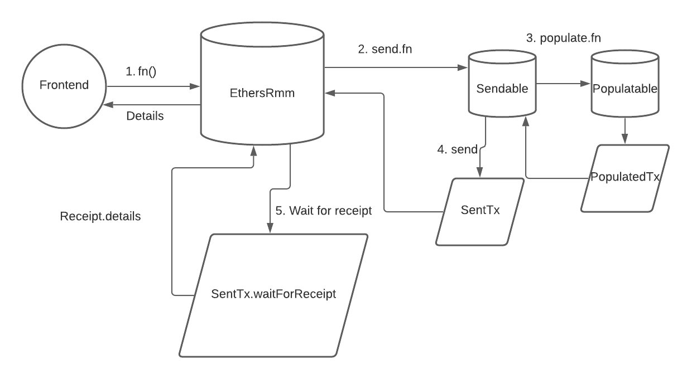

# rmm-ethers

Inspired by Liquity Ethers.

## Overview



1. User (frontend, connected user, etc.) calls a function in EthersRmm.ts
2. EthersRmm calls into the SendableEthersRmm
3. SendableEthersRmm calls into PopulatableEthersRmm
4. PopulatableEthersRmm builds the transaction and packages it, sends it back to sendable
5. Sendable broadcasts the transaction to the network, returning a SentEthersRmmTransaction to EthersRmm
6. EthersRmm resolves the SentEthersRmmTransaction receipt, once a receipt exists
7. EthersRmm returns the details of the receipt to the original user.

## Usage

### Pre Requisites

Before running any command, make sure to install dependencies:

```sh
$ yarn install
```

### Compile

Compile the smart contracts with Hardhat:

```sh
$ yarn compile
```

### Test

Run the Mocha tests:

```sh
$ yarn test
```
